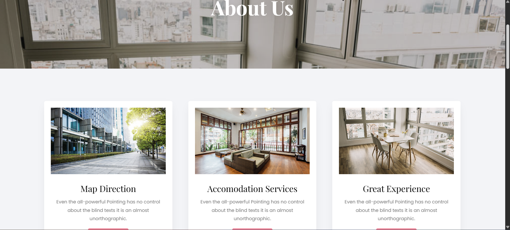
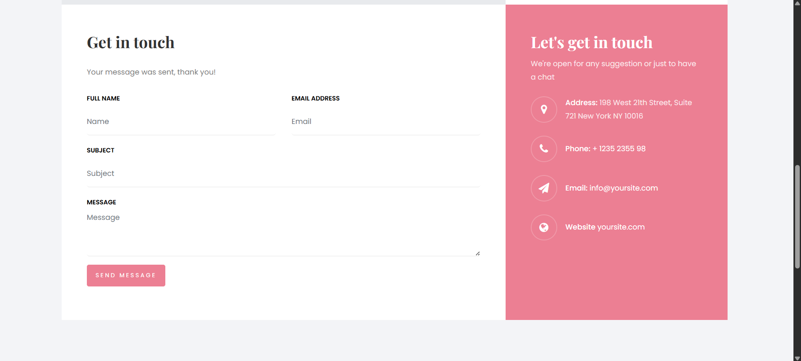
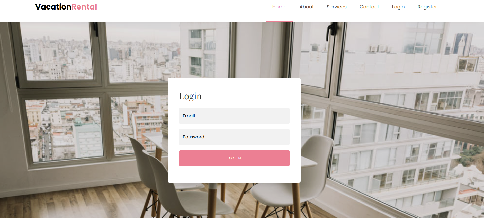
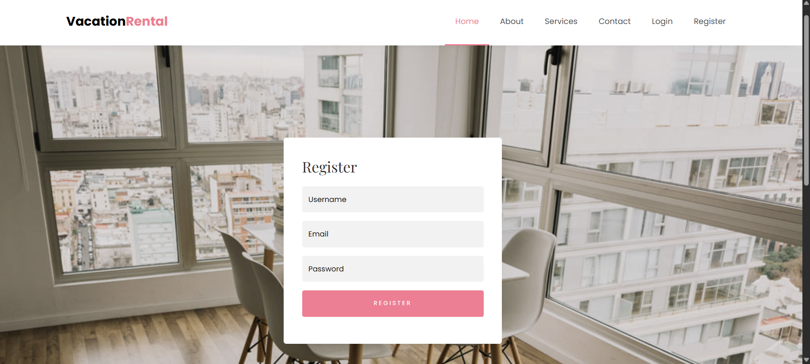
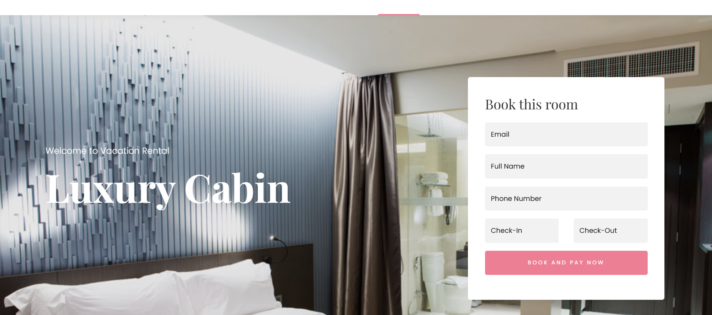
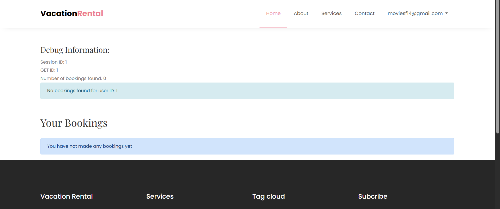
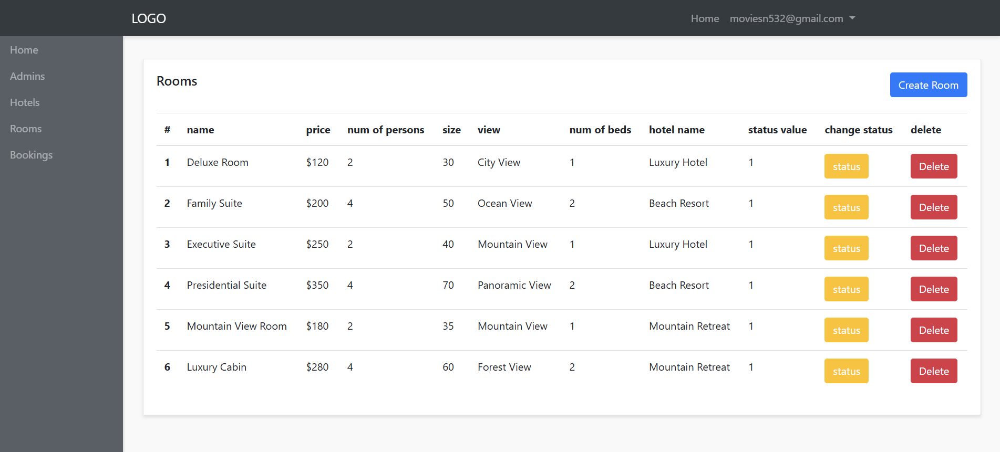
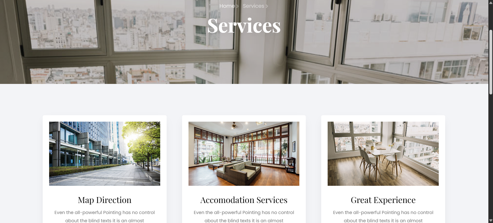

# 🏨 Hotel Booking System

A **modern PHP-based hotel reservation platform** enabling seamless room booking, user registration, and an intuitive admin dashboard for hotel managers. Built with **PHP, MySQL, SCSS**, this system delivers both frontend aesthetics and backend robustness.

  
  
  
  
  

---

## 🚀 Features

### 🧑‍💼 User Panel
- 🔐 **Secure Login & Registration**
- 🏨 **Room Listings** with images and descriptions
- 📅 **Booking System** with availability checks
- 👤 **Profile Dashboard** with booking history

### 🛠️ Admin Panel
- 📊 **Dashboard Overview** (rooms, users, bookings)
- 🛏️ **Room Management** (add/edit/delete rooms)
- ✅ **Booking Approvals & Cancellations**
- 👥 **User Management** and access logs
- 📈 **Reports Generation** (bookings, revenue)

---

## 🧰 Tech Stack

| Layer       | Technology                        |
|-------------|------------------------------------|
| Frontend    | HTML5, SCSS, CSS3, JavaScript      |
| Backend     | PHP                                |
| Database    | MySQL                              |
| Auth System | PHP Sessions                       |
| Versioning  | Git                                |

---

## 📁 Project Structure

Click to view

    hotel-booking-/
    │
    ├── 📁 admin-panel/              # Admin dashboard for managing bookings, rooms, users
    │   ├── dashboard.php            # Admin dashboard overview
    │   ├── manage-rooms.php         # Add/edit/delete room listings
    │   ├── manage-users.php         # View/manage registered users
    │   └── manage-bookings.php      # Approve/cancel bookings
    │
    ├── 📁 auth/                     # User authentication logic
    │   ├── login.php                # User login page
    │   ├── register.php             # User registration page
    │   └── logout.php               # Logout handler
    │
    ├── 📁 config/                   # Configuration files
    │   └── db_config.php            # Database connection settings
    │
    ├── 📁 css/                      # Compiled stylesheets
    │   └── style.css                # Main CSS file
    │
    ├── 📁 fonts/                    # Custom fonts (if used)
    │
    ├── 📁 images/                   # UI and hotel-related images
    │
    ├── 📁 includes/                 # Reusable components
    │   ├── header.php               # Site header/navbar
    │   └── footer.php               # Site footer
    │
    ├── 📁 js/                       # JavaScript for interactivity
    │   └── main.js                  # Custom JS code
    │
    ├── 📁 rooms/                    # Room browsing and booking
    │   ├── room-details.php         # Single room view
    │   └── book-room.php            # Room booking logic
    │
    ├── 📁 scss/                     # SCSS source files
    │   └── style.scss               # Main SCSS file
    │
    ├── 📁 users/                    # User profile and history
    │   └── profile.php              # View/edit profile and past bookings
    │
    ├── 📄 404.php                   # Custom error page
    ├── 📄 about.php                 # About the hotel/company
    ├── 📄 contact.php               # Contact form for inquiries
    ├── 📄 database.sql              # SQL script to set up the MySQL database
    ├── 📄 index.php                 # Homepage with hero, featured rooms, CTA
    ├── 📄 rooms.php                 # List of available rooms
    ├── 📄 services.php              # Hotel services (spa, dining, etc.)
    ├── 📄 README.md                 # Project documentation
    

---

## 📸 Project Screenshots

| Page/Section       | Screenshot                            | Description                                 |
|--------------------|----------------------------------------|---------------------------------------------|
| 🏠 Home Page        |                 | Main landing page for visitors              |
| ℹ️ About Page       |               | Project overview and purpose                |
| 📩 Contact Page     |           | User contact form for queries               |
| 🔐 Login Page       |               | Existing users can securely log in          |
| 📝 Register Page    |         | New user registration form                  |
| 🧾 Book Page        |                 | Form to book a service or item              |
| 📆 Booking Page     |           | Displays user's bookings                    |
| ⚙️ Admin Panel      |               | Admin dashboard for managing data           |
| 🛠️ Service Page     |           | Lists all available services                |

---

## ⚙️ Getting Started

click to view

### ✅ Prerequisites
- PHP 7.x or later  
- MySQL Server  
- Web Server (XAMPP, WAMP, or Nginx)  
- Git  

---

### 🚀 Installation Steps

#### 1. Clone the Repository

    git clone https://github.com/bhaktofmahakal/hotel-booking-.git
    cd hotel-booking-

2. Set Up the Database

        Create a database named hotel_booking
        
        Import database.sql into your MySQL server

3. Configure Database Connection

        Update credentials in config/db_config.php:
        
        define('DB_SERVER', 'localhost');
        define('DB_USERNAME', 'your_username');
        define('DB_PASSWORD', 'your_password');

4. Run the Application
   
        Place the project folder in your web root (htdocs for XAMPP)
        
        Start Apache and MySQL

---

🤝 Contributing

We welcome contributions from developers!

---

📬 Contact

Developer: Utsav Mishra

📧 Email: utsavmishraa005@gmail.com

🌐 Portfolio: https://portfolio-nine-ecru-23.vercel.app/

💼 LinkedIn: https://linkedin.com/in/utsav-mishra1

🐙 GitHub: https://github.com/bhaktofmahakal

---

📝 License

This project is licensed under the MIT License.

---

🙌 Acknowledgements

Inspired by real-world hotel management systems.

